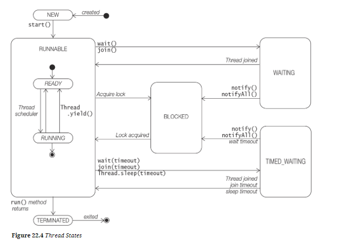

CURS 12

# **THREADS**
Proces = Un program aflat in executare.

Fir de executare (Thread) = o succesiune secventiala de instructiuni care se executa in cadrul unui proces.

Nu poate fi rulat independent.

Fiecarui fir de executare ii sunt alocate instructiuni, registri si o stiva.

Pot accesa simultan resursele procesului parinte.

Utilizarea firelor de executare duce la cresterea preformantei mai ales in cadrul sistemelor multiprocesor sau multicore.

Un fir de executare poate fi creat prin doua metode:
1. extinderea clasei Thread

       class FirDeExecutare1 extends Thread{     

         @Override
         public void run(){
            //SECVENTA DE COD ASOCIATA FIRULUI DE EXECUTIE
         }
       }

       public class Main{
            public static void main(String[] args){
               FirDeExecutare1 f1 = new FirDeExecutare1();
               f1.start(); //metoda start va porni thread-ul
                           //aceasta va invoca metoda run
            }
       }

2. implementarea interfetei Runnable

       class FirDeExecutare2 implements Runnable{
          @Override
          public void run(){
              //SECVENTA DE COD ASOCIATA FIRULUI DE EXECUTIE
          }
       }

       public class Main{
         public static void main(String[] args){
            FirDeExecutare2 f1 = new FirDeExecutare2();
            Thread t = new Thread(f2);
            t.start(); //metoda start va porni thread-ul
                       //aceasta va invoca metoda run

            //Un thread definit utilizand lambda expresion
            Thread thread = new Thread(
                    () -> System.out.println("Harmonious threads create beautiful applications.")
                    );
            thread.start();
         }
       }
In ambele variante trebuie redefinita/implementata metoda run.

Probleme ale thread urilor:

**deadlock**

cand threadurile pun lock pe obiecte dorite de alte thread uri

Thread urile sunt in waiting.

**starvation**

Apare atunci cand thread ul este permanent in starea de waiting pentru a fi executat.

**livelock**

Este atunci cand un thread urile isi raspund cu o actiune care face undo sau revert reciproc.

Thread urile isi raspund unul celuilalt dar nu se face niciun progres.

# **SOCKETS**

Sunt folositi pentru comunicarea in retea intre aplicatii de tip client/server.

Aplicatia Server utilizeaza clasa ServerSocket pentru a defini portul pe care ruleaza serverul.

Serverul accepta mesaje din partea clientului.

Aplicatia de tip Client utilizeaza clasa Socket pentru a comunica cu serverul pe o adresa si un port.
